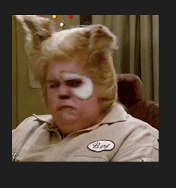

# Description
## Hello World
This is a simple Hello World mod. Please ignore

Is this commit signed? It was made using VSCode in WSL.
no, that commit was signed from command line by forcing tty which prompted for passphrase
`GPG_TTY=$(tty) GIT_TRACE=1 git commit`

Started gpg-agent and attempting cli commit
`GIT_TRACE=1 git commit -a`

That seemed to work
Let's try from vscode.
again
